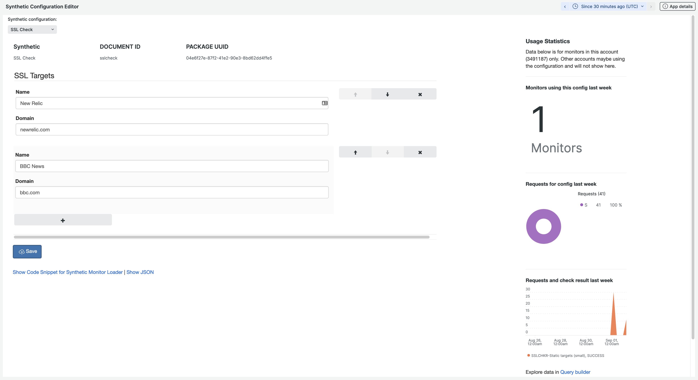

[](https://opensource.newrelic.com/oss-category/#new-relic-experimental)

# Synthetic Configurator


A mechanism based upon NerdStorage to allow configuration of synthetic monitors via an NR1 Application. This enables you to change runtime settings of a synthetic script using an easy to use form rather than editing the synthetic directly. This is particularly useful if you have a synhtetic script that needs configuration that may change occasionally and you want non-developers to be able to amend that configuration.



## Installation
The custom application should be deployed like an other custom Nerdpack. Information about deploying nerdpacks can be found on the [docs site.](https://developer.newrelic.com/build-apps/publish-deploy)

Before deploying the application to your acount you MUST set your account ID in the code so that the configuration is stored in the correct account. You can set the value for `accountId` in the file [index.js](./nerdlets/nr1-synthetic-configurator/index.js)


## Configuring synthetics schemas
The requirements of every synthetic will be different. You need to know the shape of the config data your script expects and use that to define a JSONschema (see example below). This JSON schema is used to automatically build the form. Click the `Manage Synthetic Schemas` button to add and edit synhthetic schemas. Each configuration requires:
- Name: A friendly name of the configuration
- ID: A unique ID for this configuration item. This will be used by your synthetic to identify which configuration it wants.
- Schema: A JSON schame defining the shape of the configuration object you require 

[JSON schema](https://json-schema.org/) forms can manage quite complicated data objects including strings, numbers, enumerations and arrays of objects, checkout the [JSON schema playground](https://rjsf-team.github.io/react-jsonschema-form/) for ideas. 


### Example Schema
Here is an example of a configuration and the related schema required, you can use this as inspiration for your own requirements. You might need to configure a set of URL's or product numbers for instance.

In this example we're modelling the configuration for an ice cream shop. Here we demonstrate strings, numbers, booleans, arrays and enumerated types. Here is the configuration object that my script currently uses:
```
const CONFIG = {
    "shopName": "James Ice Cream Emporium",
    "opens": "10am",
    "closes": "4pm",
    "saleOn": true,
    "flavours": [
        { 
            "name": "Raspberry ripple",
            "color": "Pink",
            "price": 1.99
        },
        { 
            "name": "Chocolate",
            "color": "Brown",
            "price": 1.49
        }
    ]
}
```

This is the accompanying JSON schema we need to drive the form. Notice the following features:
- Its possible to mark fields as required
- Boolean fields (saleOn) will render a checkbox
- You can specify arrays, the items within which can be re-ordered
- You can provide an enumerated list of options to choose from (color)
- You can provide default values (e.g. on the color attribute we default to white)

```
{
  "title": "Ice Cream Configuration",
  "description": "Configure the icecreams here!",
  "type": "object",
  "required": [
    "shopName",
    "opens",
    "closes"
  ],
  "properties": {
    "shopName": {
      "type": "string",
      "title": "Shop name"
    },
    "opens": {
      "type": "string",
      "title": "Opening time"
    },
    "closes": {
      "type": "string",
      "title": "Closing time"
    },
    "saleOn": {
        "type": "boolean",
        "title": "Sale on now"
    },
    "flavours": {
        "type": "array",
        "title": "Flavours",
        "items": {
            "type": "object",
            "required": [
                "name",
                "color",
                "price"
            ],
            "properties": {
                "name": {
                    "type": "string",
                    "title": "Flavour name"
                },
                "color": {
                    "type": "string",
                    "title": "Color",
                    "default": "White",
                    "enum": [
                        "Pink",
                        "Brown",
                        "Yellow",
                        "White",
                        "Blue"
                    ]
                },
                "price": {
                    "type": "number",
                    "title": "Price"
                }
            }
        }
    }
  }
}
```

## Using the configuration
Once you have defined the schema you should be able to choose it from the drop down list and start filling in the data for your configuration. To load this configuration from your synthetic monitor click the "Show Code Snippet for Synthetic Monitor Loader" link which will reveal a code snippet to paste into your synthetic. This is in two parts, the load first which is an uglified compressed version of [source.js](./example-synthetic/source.js). This exposes a method `grabConfig(CONFIG_ID, ACCOUNT_ID, REGION, NERDPACK_PACKAGE_UUID, USER_API_KEY)` which will be auto filled with the correct values <em>except</em> USER_API_KEY which you will need to provide yourself, preferably via a secure credntial. You may need to update the other values too.

The second part of the snippet is an example of how to call the `grabConfig()` method, you'll need to await the response before using the resulting value, be sure to provide your own validation of the data if necessary.

## Statistics
The statistics shown against a configuration are sourced from the SyntheticCheck event. When your synthetic monitor requests the config a custom attribute `configurator` is set with the nerdpack UUID and config id. These statistics will only be accurate for synthetics runing in the account the app is deployed. If you are loading the confiuration from a synthetic in another account then the data will reside in that account (and be queryable) but will not appear on the charts in the app.

## Support
Issues should be raised via Github issues https://github.com/newrelic-experimental/nr1-synthetic-configurator/issues

## Contributing
We encourage your contributions to improve Synthetic Configurator! Keep in mind when you submit your pull request, you'll need to sign the CLA via the click-through using CLA-Assistant. You only have to sign the CLA one time per project.
If you have any questions, or to execute our corporate CLA, required if your contribution is on behalf of a company,  please drop us an email at opensource@newrelic.com.

**A note about vulnerabilities**

As noted in our [security policy](../../security/policy), New Relic is committed to the privacy and security of our customers and their data. We believe that providing coordinated disclosure by security researchers and engaging with the security community are important means to achieve our security goals.

If you believe you have found a security vulnerability in this project or any of New Relic's products or websites, we welcome and greatly appreciate you reporting it to New Relic through [HackerOne](https://hackerone.com/newrelic).

## License
Synthetic Configurator is licensed under the [Apache 2.0](http://apache.org/licenses/LICENSE-2.0.txt) License.

